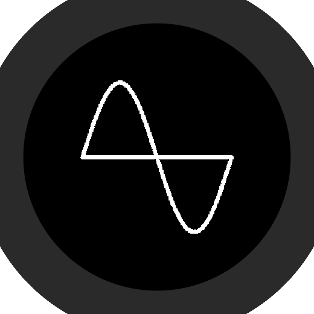

<div align="center">
    
</div>

# LearnMath App [BETA]

LearnMath is a website where you can learn mathematics for free. This app will open for you the website faster than before in just a click.

## 📀 Installation

There are two possible ways to install LearnMath app in your machine:

### Normal:

Download our portable executable file that fits your operating system from [here](https://github.com/microsoft/terminal/releases). Then, extract the file and start `learnmath.exe`

> **ⓘ Supported operating systems:**
>
> Windows 10/11

### Code:

**► First time running:**

Download the source code using git or from [here](https://github.com/LearnMathWeb/App/archive/refs/heads/main.zip). 

After doing so, make sure to install required dependencies to be able to start or to build the app using this command:

```bash
npm install
```

> This will download and install all dependencies listed in `package.json`. This includes some packages that are needed to build the app that you may not need. If you just want to run the program without building it at all, you can execute `npm install --save-dev electron`

Wait for all packages to be downloaded and installed.

Done! You are ready to open the app!

**► After installation:**

Execute this following command to start the app:

```bash
npm test
```

## 📋 Requirements

Your device should meet these requirements for a better experience:

|          | Requirements   |
| -------- | -------------- |
| Storage  | Free `+400 MB` |
| Free RAM | `+230 MB`      |
| OS       | Windows 10, 11 |

> **ⓘ NOTE:**
>
> Other requirements may not be included.

## 👾 Contribution

Everyone can contribute to this project no matter who they are as long as they know what they are doing.

You need to follow these rules to be able to contribute. If you do not, your pull request will be rejected.

- Do not remove/change any essential package.
- Do not add any third-party website.
- Write codes that everyone can understand.

> **ⓘ NOTE:**
>
> Keep in mind, we may use another devDependency other than electron in future since this software is still being tested and on BETA.

## ❤️ Support

Just give us a star. Only that will support us to continue working on this app :)